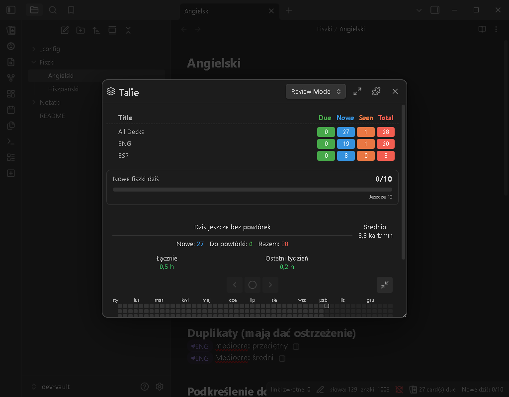
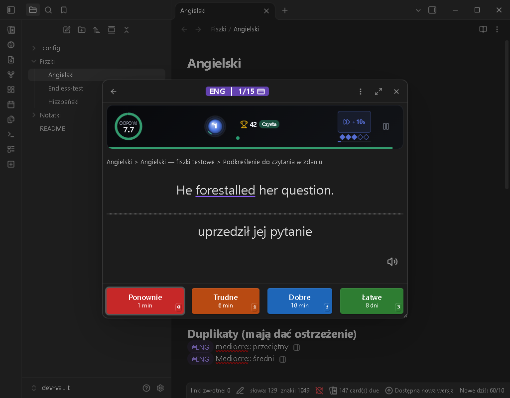
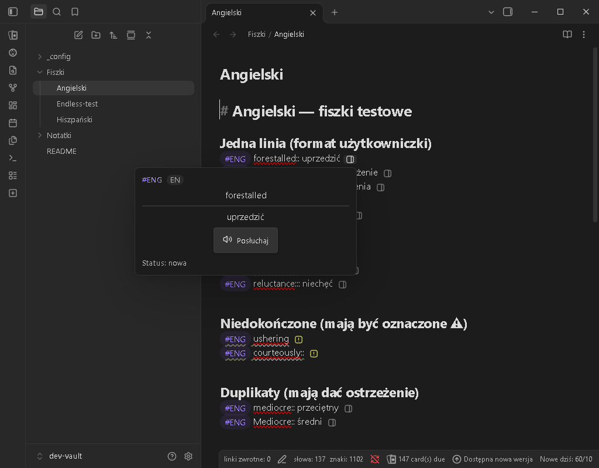
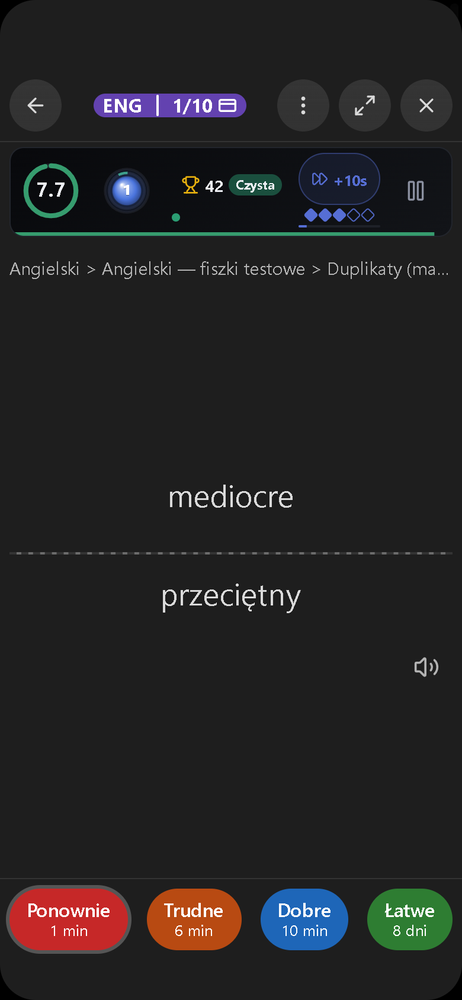
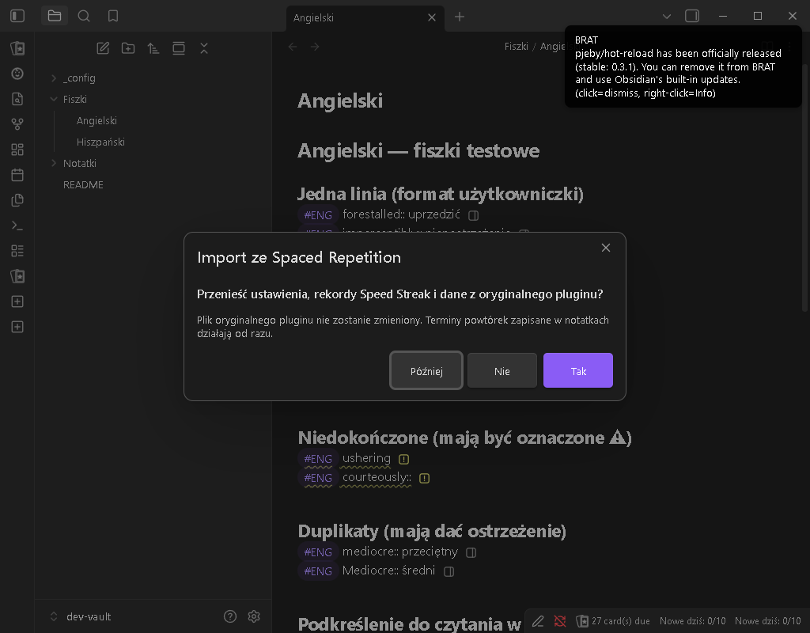

# Upgraded Spaced Repetition

An extended version of [Obsidian Spaced Repetition](https://github.com/st3v3nmw/obsidian-spaced-repetition) for [Obsidian](https://obsidian.md): the same flashcards, notes review and scheduling (SM-2 and FSRS), plus a set of add-ons for learning vocabulary fast — on Windows, macOS, iPad, iPhone and Android.

> **Beta.** Version 0.9.0 is the first public build. It is installed with **BRAT** (see below), not from Obsidian's community plugin list. The plugin name may still change before 1.0; the plugin id `upgraded-spaced-repetition` will not.

Your flashcards stay plain Markdown, and review dates stay in the same `<!--SR:…-->` comments as in the original plugin, so the two plugins read the same notes.



## Add-ons

Each add-on is a **built-in plugin** that can be turned on or off in the **Options** window (gear icon in the deck list header) or on the main settings page.

- **Speed Streak** — a timer game ported from the Anki add-on: a timer for the question and the answer, a streak counter, **Time Boost** (+10 s, earned every 10 cards), records (all-time, today, "pure" streaks, top 5), a compact bar or a side panel, 4 visual styles and 10 color themes.
- **Read aloud** — after the answer is shown, the foreign word or sentence is read with the voices installed on your device (works offline). Mark words with `<u>…</u>`, set a language per tag or deck.
- **Card authoring** — add cards in seconds right in the note: `Ctrl+Shift+N` inserts a template (`#ENG |:::`), `Tab` jumps to the translation, `Ctrl+Enter` finishes the card. A preview icon next to every card, warnings for unfinished cards and duplicates, images from the clipboard, gallery or camera.
- **Endless mode** — tick decks and practise them without end in shuffled rounds; nothing is scheduled, the notes are not changed. Speed Streak keeps its own Endless record and counts the cards of the session.
- **Daily goal** — "New today: 4/10" and a progress bar for new cards.
- **Review calendar** — a year heatmap below the deck list with pace, time and day streaks; collapses to a progress ring.
- **Review window** — full screen on/off, drag the window by its header, position remembered.
- **Import from the original plugin** — one click to copy settings, Speed Streak records and history (see below).

| Review with Speed Streak                                 | Card preview in the editor                   | Phone                                                   |
| -------------------------------------------------------- | -------------------------------------------- | ------------------------------------------------------- |
|  |  |  |

Full description of the add-ons (in Polish): [SPEED-STREAK-README.md](SPEED-STREAK-README.md). Changes per version: [CHANGELOG-UPGRADED.md](CHANGELOG-UPGRADED.md).

For everything that comes from the original plugin — card formats, decks, cloze cards, notes review, algorithms — see the [original documentation](https://stephenmwangi.com/obsidian-spaced-repetition/).

## Installation with BRAT

[BRAT](https://github.com/TfTHacker/obsidian42-brat) installs plugins straight from GitHub releases and keeps them updated. The steps are the same on a computer, iPad, iPhone and Android.

1. **Turn on community plugins**: Settings → Community plugins → **Turn on community plugins** (on a phone: Settings → Community plugins → turn off _Restricted mode_).
2. **Install BRAT**: Settings → Community plugins → **Browse** → search for `BRAT` → **Install** → **Enable**.
3. **Add this plugin**: Settings → BRAT → **Add beta plugin** → paste
    ```
    luckyflickerman/obsidian-spaced-repetition
    ```
    choose the latest version and click **Add plugin**.
4. **Enable it**: Settings → Community plugins → turn on **Upgraded Spaced Repetition**.
5. **Automatic updates**: Settings → BRAT → turn on **Auto-update plugins at startup** (the name can differ slightly between BRAT versions). New releases are then installed when Obsidian starts. You can also run the command _BRAT: Check for updates to all beta plugins_ any time.

Requires Obsidian **1.11.0** or newer.

## Moving from the original Spaced Repetition

1. Install this plugin as above. On the first start it finds the original plugin's data and asks: **"Move settings, Speed Streak records and data from the original plugin?"** — Yes / No / Later.
2. **Yes** copies the settings, Speed Streak records, the review calendar history and the rest of the data. The original plugin's files are not changed.
3. Then **turn off the original plugin**: Settings → Community plugins → _Spaced Repetition_ off. With both on, every card is counted twice (two status bar counters, two icons next to each card).

Missed the window or chose "Later"/"No"? Run the command **"Import data from the original Spaced Repetition"** from the command palette (on a phone: swipe down or use the toolbar button). Review dates live in your notes, so they work right away either way. Custom hotkeys have to be set again, because commands now belong to the new plugin id.



## Credits

- **[Obsidian Spaced Repetition](https://github.com/st3v3nmw/obsidian-spaced-repetition)** by **Stephen Mwangi** and all its contributors — this plugin is built on their work (MIT license). The original README is kept in [docs/README-original.md](docs/README-original.md).
- **[Speed Streak for Anki](https://github.com/henbitdeathmetal/anki-speed-streak)** — the idea and the game design of the Speed Streak add-on. See [THIRD_PARTY_NOTICES.md](THIRD_PARTY_NOTICES.md).
- Bugs and ideas: [issues](https://github.com/luckyflickerman/obsidian-spaced-repetition/issues).

## Po polsku

**Upgraded Spaced Repetition** to rozszerzona wersja pluginu Obsidian Spaced Repetition: te same fiszki i powtórki, a do tego Speed Streak (gra z timerem i serią), czytanie na głos, szybkie tworzenie fiszek, cel dzienny, kalendarz powtórek i wygodne okno powtórek. Działa na komputerze, iPadzie i telefonie.

**Instalacja (komputer, iPad, telefon):**

1. Ustawienia → Wtyczki społeczności → włącz wtyczki społeczności (na telefonie wyłącz _Tryb ograniczony_).
2. **Przeglądaj** → wyszukaj `BRAT` → **Zainstaluj** → **Włącz**.
3. Ustawienia → BRAT → **Add beta plugin** → wklej `luckyflickerman/obsidian-spaced-repetition` → najnowsza wersja → **Add plugin**.
4. Ustawienia → Wtyczki społeczności → włącz **Upgraded Spaced Repetition**.
5. Ustawienia → BRAT → włącz **Auto-update plugins at startup**, żeby nowe wersje instalowały się same.

**Przeniesienie danych:** przy pierwszym uruchomieniu plugin zapyta, czy przenieść ustawienia, rekordy Speed Streak i dane z oryginalnego pluginu (Tak / Nie / Później). Po „Tak” **wyłącz oryginalny plugin** Spaced Repetition w Ustawieniach → Wtyczki społeczności, żeby fiszki nie były liczone podwójnie. Import można też zrobić później komendą „Importuj dane z oryginalnego Spaced Repetition”. Terminy powtórek są zapisane w notatkach, więc działają od razu.

Pełny opis dodatków: [SPEED-STREAK-README.md](SPEED-STREAK-README.md).

## License

MIT — see [LICENSE](LICENSE).
