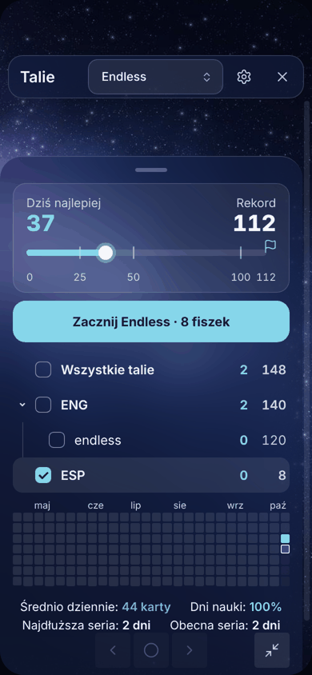
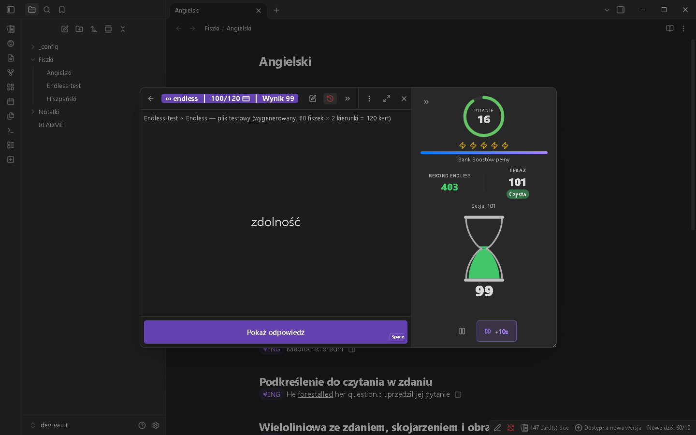
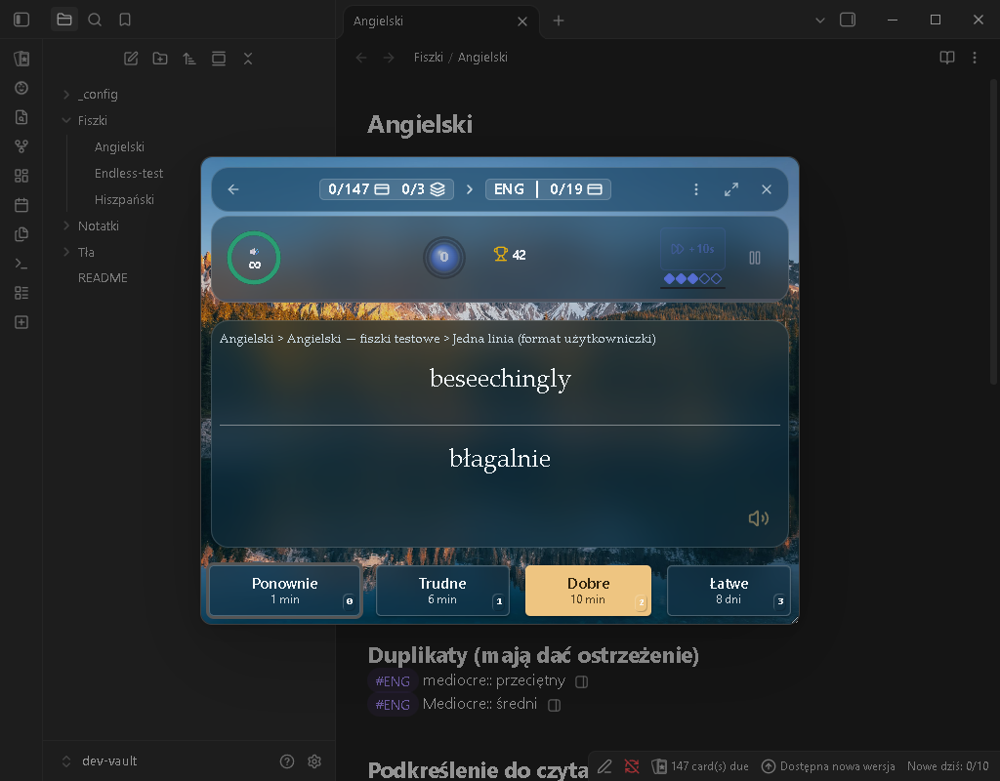
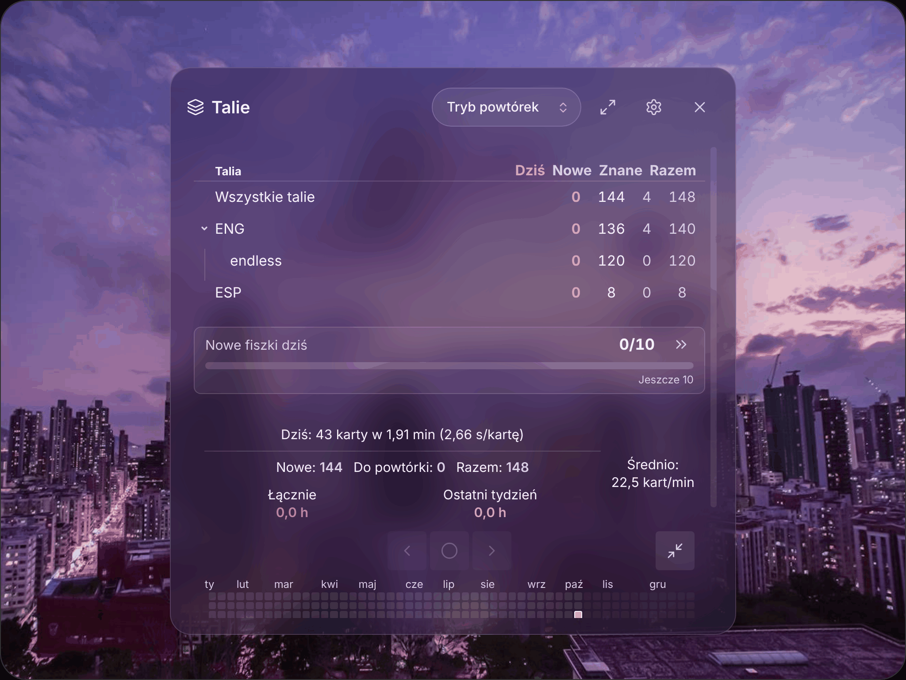
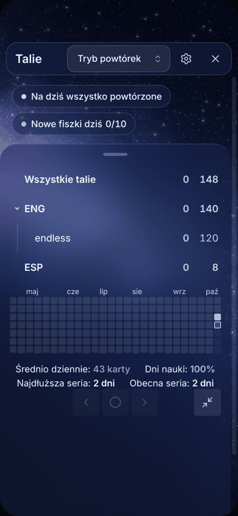
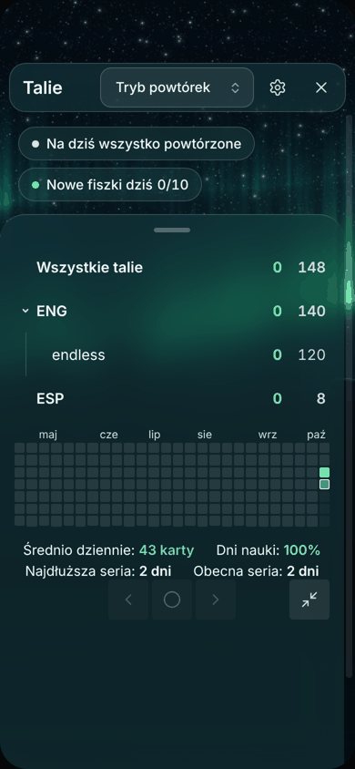

# Fishcards

**Flashcards for [Obsidian](https://obsidian.md) with spaced repetition and a speed game.** Write your cards as plain Markdown in your notes, review them with SM-2 or FSRS scheduling, and keep your streak alive with a timer — on Windows, macOS, iPad, iPhone and Android.

> **Beta.** Fishcards is installed with **BRAT** (see below), not yet from Obsidian's community plugin list. It is an extended version of [Spaced Repetition](https://github.com/st3v3nmw/obsidian-spaced-repetition) by Stephen Mwangi — see [Credits](#credits). The plugin id stays `upgraded-spaced-repetition`, so settings and data survive the rename.

Your flashcards stay plain Markdown, and review dates stay in the same `<!--SR:…-->` comments as in the original plugin, so both plugins read the same notes.


## What's inside

Everything from the original plugin — card formats, decks, cloze cards, notes review, SM-2 and FSRS — plus a set of **built-in plugins**. Each one can be turned on or off in the **Options** window (gear icon in the deck list header) or on the main settings page.

- **Speed Streak** — a timer game ported from the Anki add-on: a timer for the question and the answer, a streak counter, records (all-time, today, "pure" streaks, top 5), a compact bar or a side panel, visual styles (Fusion Rings, Singularity, Crystal Reactor, Hourglass, Minimal) and colour themes. Optional Time Boosts (+10 s, earned every 10 cards) are off by default.
- **Endless mode** — tick decks and practise them without end in shuffled rounds; nothing is scheduled and your notes are not changed. "Got it" adds a point, "Hard" adds nothing, "Error" resets the score. A record card shows today's best on the way to your all-time record.
- **Read aloud** — after the answer is shown, the foreign word or sentence is read with the voices installed on your device (works offline). Mark words with `<u>…</u>`, set a language per tag or deck.
- **Card authoring** — add cards in seconds right in the note: insert a template (`#ENG |:::`), `Tab` jumps to the translation, one command finishes the card. A preview icon next to every card, warnings for unfinished cards and duplicates, images from the clipboard, gallery or camera.
- **Background themes** — **Lake**, **Dusk**, **Space** and **Aurora**: a picture built into the plugin behind the review, with see-through glass panels in its colours, always readable. On a computer and an iPad everything sits in one panel in the middle; on a phone the decks lie on a sheet under the picture.
- **Daily goal** — "New cards today 4/10" with a progress bar.
- **Review calendar** — a year heatmap below the deck list with pace, time and day streaks.
- **Review window** — full screen on/off; on a computer drag the window by its header, its position is remembered.
- **Polish and English** — every new feature speaks both; intervals use proper Polish plurals ("1 dzień", "3 dni").
- **Import from the original plugin** — one click to copy settings, Speed Streak records and history (see below).

| Review with Speed Streak                                 | Card preview in the editor                   | Phone                                                   |
| -------------------------------------------------------- | -------------------------------------------- | ------------------------------------------------------- |
|  |  |  |

| Endless record on a phone                                         | Endless with the Hourglass                                            |
| ----------------------------------------------------------------- | --------------------------------------------------------------------- |
|  |  |

| Theme "Lake"                                                   | Theme "Dusk" on an iPad                                              | Theme "Space"                                                     | Theme "Aurora"                                                      |
| -------------------------------------------------------------- | -------------------------------------------------------------------- | ----------------------------------------------------------------- | ------------------------------------------------------------------- |
|  |  |  |  |

Background pictures: Tobias Reich ("Lake") and Henry Lai ("Dusk") on Unsplash; "Space" and "Aurora" are drawn for this plugin ([script](scripts/generate-theme-photos.py)).

Full description of the built-in plugins (in Polish): [SPEED-STREAK-README.md](SPEED-STREAK-README.md). Changes per version: [CHANGELOG-UPGRADED.md](CHANGELOG-UPGRADED.md). For everything that comes from the original plugin, see the [original documentation](https://stephenmwangi.com/obsidian-spaced-repetition/).

## Installation with BRAT

[BRAT](https://github.com/TfTHacker/obsidian42-brat) installs plugins straight from GitHub releases and keeps them updated. The steps are the same on a computer, iPad, iPhone and Android.

1. **Turn on community plugins**: Settings → Community plugins → **Turn on community plugins** (on a phone: turn off _Restricted mode_).
2. **Install BRAT**: Settings → Community plugins → **Browse** → search for `BRAT` → **Install** → **Enable**.
3. **Add Fishcards**: Settings → BRAT → **Add beta plugin** → paste
    ```
    luckyflickerman/obsidian-spaced-repetition
    ```
    choose the latest version and click **Add plugin**.
4. **Enable it**: Settings → Community plugins → turn on **Fishcards**.
5. **Automatic updates**: Settings → BRAT → turn on **Auto-update plugins at startup**. New releases are then installed when Obsidian starts.

Requires Obsidian **1.11.0** or newer. No account, no network, no telemetry — everything stays in your vault.

## Getting started

1. Tag a note with a deck tag (for example `#flashcards`, or set your own tags in Settings → Fishcards → Flashcards).
2. Write cards, one per line: `question::answer` (one direction) or `question:::answer` (both directions). Multi-line cards use `?` on its own line between question and answer.
3. Click the **Review flashcards** icon in the ribbon (or run **Review flashcards from all notes** from the command palette) and pick a deck.
4. Optional: open **Options** (gear icon) and choose a background theme.

Tip: card authoring comes with `Ctrl+Shift+N` (new card) and `Ctrl+Enter` (finish the card); change them in Settings → Hotkeys (search "Fishcards").

## Moving from the original Spaced Repetition

1. Install Fishcards as above. On the first start it finds the original plugin's data and asks: **"Move settings, Speed Streak records and data from the original plugin?"** — Yes / No / Later.
2. **Yes** copies the settings, Speed Streak records, the review calendar history and the rest of the data. The original plugin's files are not changed.
3. Then **turn off the original plugin**: Settings → Community plugins → _Spaced Repetition_ off. With both on, every card is counted twice.

Missed the window? Run **"Import data from the original Spaced Repetition"** from the command palette. Review dates live in your notes, so they work right away either way. Custom hotkeys have to be set again, because the commands belong to the new plugin.


## Credits

- **[Spaced Repetition](https://github.com/st3v3nmw/obsidian-spaced-repetition)** by **Stephen Mwangi**, maintained with **Kyle Klus** and many contributors — Fishcards is built on their work (MIT license). The original README is kept in [docs/README-original.md](docs/README-original.md).
- **[Speed Streak for Anki](https://github.com/henbitdeathmetal/anki-speed-streak)** — the idea and the game design of the Speed Streak add-on. See [THIRD_PARTY_NOTICES.md](THIRD_PARTY_NOTICES.md).
- Bugs and ideas: [issues](https://github.com/luckyflickerman/obsidian-spaced-repetition/issues).

## Po polsku

**Fishcards** (gra słów: „fiszki” + _flashcards_) to fiszki dla Obsidiana z powtórkami w odstępach i grą na czas. Rozszerzona wersja pluginu Spaced Repetition: te same fiszki i terminy powtórek, a do tego Speed Streak, tryb Endless z rekordami, czytanie na głos, szybkie tworzenie fiszek, cel dzienny, kalendarz powtórek i cztery motywy tła. Działa na komputerze, iPadzie i telefonie.

**Instalacja (komputer, iPad, telefon):**

1. Ustawienia → Wtyczki społeczności → włącz wtyczki społeczności (na telefonie wyłącz _Tryb ograniczony_).
2. **Przeglądaj** → wyszukaj `BRAT` → **Zainstaluj** → **Włącz**.
3. Ustawienia → BRAT → **Add beta plugin** → wklej `luckyflickerman/obsidian-spaced-repetition` → najnowsza wersja → **Add plugin**.
4. Ustawienia → Wtyczki społeczności → włącz **Fishcards**.
5. Ustawienia → BRAT → włącz **Auto-update plugins at startup**, żeby nowe wersje instalowały się same.

**Przeniesienie danych:** przy pierwszym uruchomieniu plugin zapyta, czy przenieść ustawienia, rekordy Speed Streak i dane z oryginalnego pluginu (Tak / Nie / Później). Po „Tak” **wyłącz oryginalny plugin** Spaced Repetition, żeby fiszki nie były liczone podwójnie. Import można też zrobić później komendą „Importuj dane z oryginalnego Spaced Repetition”. Terminy powtórek są zapisane w notatkach, więc działają od razu.

Pełny opis dodatków: [SPEED-STREAK-README.md](SPEED-STREAK-README.md).

## License

MIT — see [LICENSE](LICENSE).
